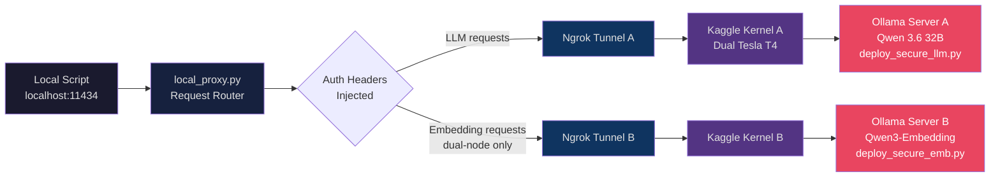

# 🌑 ShadowGPU: Headless Kaggle GPU Tunneling

ShadowGPU is a lightweight, zero-cost architecture that lets you run massive Large Language Models (like the 32B Qwen 3.6) on Kaggle's free dual Tesla T4 GPUs and reach them directly from your local development environment — no browser, no GUI, no cloud bill.

It provides a 100% headless, browser-free experience with a real-time streaming kill switch to preserve your Kaggle compute quotas.

> **Research & Experimentation Use:** This project is designed for personal AI research and local experimentation. Treat your Kaggle GPU quota as the finite shared resource it is — spin kernels up when you need them, kill them promptly when you don't.

---

## 🏗️ Architecture




**Data path:** Local script → Proxy (injects auth headers) → Ngrok HTTPS tunnel → Kaggle kernel → Ollama (VRAM-locked)

---

## ✨ Key Features

- **Massive Compute:** Run 24GB+ LLMs on Dual 16GB Tesla T4 GPUs for free.
- **Ngrok Tunneling:** Exposes the remote Ollama server securely to the public internet — OS-agnostic (works across WSL, Windows, Mac).
- **Zero Cold-Starts:** Forces VRAM locking (`KEEP_ALIVE="-1"`) to guarantee 50+ tokens/second inference speeds.
- **Dual-Node Split:** Dedicated `ngrok_dual/` scripts run LLM and embedding models on separate Kaggle kernels simultaneously, giving each model its own tunnel and kill switch.
- **LangChain & LangGraph Ready:** Fully compatible with `ChatOllama` for seamless integration into multi-agent frameworks.
- **Streaming Kill Switch:** A real-time `ntfy.sh` listener instantly kills the remote Kaggle kernel via a local CLI command.

---

## 📋 Prerequisites: Kaggle Authentication (One-Time Setup)

Before using the deployment commands, your local terminal must be linked to your Kaggle account. Choose one of the two methods below.

### Option 1: Web Login (Recommended)

This is the fastest method if you have a web browser on your machine.

1. Open your terminal and run:
  ```bash
   kaggle auth login
  ```
2. The terminal will output a secure URL. Click or copy-paste it into your browser.
3. Log into Kaggle and click **Authorize**. Your terminal will instantly confirm the successful connection.

### Option 2: Manual Token Fallback (For Headless Servers)

Use this if you are running from a remote server without a web browser.

1. Go to **Kaggle.com** → Click your profile picture → **Settings**.
2. Scroll down to the **API** section and click **Create New Token**. This downloads a `kaggle.json` file.
3. Move that file to your hidden credentials directory:
  - **Linux/WSL:** `~/.kaggle/kaggle.json`
  - **Windows:** `C:\Users\<Your-Username>\.kaggle\kaggle.json`
4. Secure the file permissions (Linux/WSL only):
  ```bash
   chmod 600 ~/.kaggle/kaggle.json
  ```

### Local Environment Setup

Install the Python dependencies needed to run the local proxy and client examples:

```bash
pip install -r requirements.txt
```

---

## 📂 Repository Structure

```text
shadowgpu/
├── tunnels/
│   ├── cloudflare/
│   │   ├── deploy_open.py          # Quick Tunnel (Random URL)
│   │   └── deploy_secure.py        # Zero Trust Tunnel (Persistent Custom Domain)
│   │
│   ├── ngrok/
│   │   ├── deploy_open.py          # Open Tunnel (Random URL)
│   │   └── deploy_secure.py        # Basic Auth Tunnel (Password Protected)
│   │
│   └── ngrok_dual/                 # ← Dual-GPU split: two kernels, two models
│       ├── deploy_secure_llm.py    # Node A: LLM server (Qwen 3.6 32B)
│       ├── deploy_secure_emb.py    # Node B: Embedding server (Qwen3-Embedding)
│       ├── dual_local_proxy.py     # Routes /api/embed vs /api/generate automatically
│       └── sample_dual.env         # Environment template for dual-node setup
│
├── local_proxy.py                  # Intelligent request router (single-node)
├── kernel-metadata.json            # Kaggle deployment config
├── sample.env                      # Environment template
├── requirements.txt                # Local Python dependencies
└── README.md
```

---

## ⚙️ Configuration (What to Change)

Before deploying, configure your local environment and secrets.

**1. `kernel-metadata.json`**

Open the file and replace `"id": "YOUR KAGGLE USERNAME/shadowgpu-server"` with your own Kaggle username.

**2. Tunnel Secrets (Inside your chosen `deploy_*.py` script)**

Open the script you plan to push and fill in the two constants at the top:

```python
NGROK_TOKEN = "YOUR_NGROK_TOKEN"          # ← Paste your Ngrok Authtoken here
NTFY_CHANNEL = "YOUR_NTFY_CHANNEL"  # ← Any unique random string
```
```markdown
⚠️ **Before you push to GitHub:** once you paste a real token in, this is the literal file `git` tracks. Don't `git add` the filled-in version. Keep a second, gitignored copy (e.g. `deploy_secure_llm.local.py`) with your real token — that's the one you point `kaggle kernels push` at. The tracked copy in GitHub stays empty.
```
Because Ngrok automatically binds your account's permanent static domain to the authtoken, your server will always launch on the exact same URL — no `.env` updates needed on restarts.

- **Cloudflare (Secure only):** Add your `CLOUDFLARE_TUNNEL_TOKEN` from your Zero Trust dashboard.
- **Notifications:** Set `NTFY_CHANNEL` to a unique, private string (e.g., `shadowgpu_xyz_123`).

**3. Local `.env` File**

Create a `.env` file in the root of this repository (copy from `sample.env`). Your `local_proxy.py` uses this to route traffic.

```env
REMOTE_HOST=https://your-permanent-static-domain.ngrok-free.dev
NTFY_CHANNEL=shadowgpu_xyz_123
LOCAL_PROXY_PORT=11434
AUTH_USER=admin
AUTH_PASS=YOUR_PASSWORD
```

For the dual-node setup, use `sample_dual.env` instead — it has separate `REMOTE_HOST_LLM` and `REMOTE_HOST_EMB` fields.

---

## 🎛️ Server Deployment Variants

ShadowGPU supports two tunneling providers and three deployment modes. Your proxy script dynamically adapts to whichever deployment mode you choose — no changes needed in your application code.

### 🌐 Provider 1: Cloudflare Tunnels

- **Variant A: Quick Tunnel (`tunnels/cloudflare/deploy_open.py`)**
  - Requires no accounts or tokens. Generates a randomized `trycloudflare.com` URL that changes on every deploy. You must manually update your local `.env` on every kernel restart.
  - Best for: zero-setup, rapid temporary testing.
- **Variant B: Zero Trust (`tunnels/cloudflare/deploy_secure.py`)**
  - Requires a free Cloudflare account and a custom domain managed by Cloudflare DNS. Maps your remote Kaggle GPUs to a permanent subdomain (e.g., `gpu.yourdomain.com`).
  - Best for: persistent personal infrastructure where you own a domain.

### 🚇 Provider 2: Ngrok Tunnels (Recommended)

Ngrok grants a free permanent static domain out of the box — claim yours at **Cloud Edge → Domains** in the Ngrok dashboard.

- **Variant A: Open Tunnel (`tunnels/ngrok/deploy_open.py`)**
  - Authenticates via your token and routes through your permanent static domain. URL never changes on kernel restart, but has no access control beyond the URL itself.
  - Best for: personal experimentation where convenience matters more than access control.
- **Variant B: Protected Tunnel (`tunnels/ngrok/deploy_secure.py`)**
  - Routes through your permanent static domain while enforcing HTTP Basic Authentication at the Ngrok edge. Unauthenticated requests receive a `401 Unauthorized`. Your local proxy injects the required Base64 credentials silently.
  - Best for: securing the endpoint against accidental public exposure.

### 🔀 Variant C: Dual-Node Split (`tunnels/ngrok_dual/`)

The most capable mode. Runs **two separate Kaggle kernels** simultaneously — one dedicated to the LLM (Qwen 3.6 32B on full dual-T4 VRAM), one to embeddings (Qwen3-Embedding on a second kernel). The `dual_local_proxy.py` routes locally by path: `/api/embed` → embedding node, everything else → LLM node. Both kernels run under the same Kaggle account; the weekly 30-hour quota is shared, so running them in parallel burns it at 2× the rate.

#### Step-by-step: pushing both nodes

**Push 1 — LLM node**

Set `kernel-metadata.json` to:

```json
{
  "id": "YOUR_KAGGLE_USERNAME/shadowgpu-llm",
  "title": "ShadowGPU LLM",
  "code_file": "tunnels/ngrok_dual/deploy_secure_llm.py",
  "language": "python",
  "kernel_type": "script",
  "is_private": "true",
  "enable_gpu": "true",
  "enable_internet": "true",
  "dataset_sources": [],
  "competition_sources": [],
  "kernel_sources": [],
  "model_sources": []
}
```

> **Important:** The `"title"` slug must match the kernel ID slug. `"ShadowGPU LLM"` → `shadowgpu-llm` ✓. A mismatch produces a warning and Kaggle may push to the wrong kernel.

```bash
kaggle kernels push -p . --accelerator NvidiaTeslaT4
# → https://www.kaggle.com/code/YOUR_USERNAME/shadowgpu-llm
```

**Push 2 — Embedding node**

Update `kernel-metadata.json`:

```json
{
  "id": "YOUR_KAGGLE_USERNAME/shadowgpu-emb",
  "title": "ShadowGPU EMB",
  "code_file": "tunnels/ngrok_dual/deploy_secure_emb.py",
  ...
}
```

```bash
kaggle kernels push -p . --accelerator NvidiaTeslaT4
# → https://www.kaggle.com/code/YOUR_USERNAME/shadowgpu-emb
```

Both kernels are now running independently. Each broadcasts its own tunnel URL to your `NTFY_CHANNEL` when ready.

Both nodes get independent kill switches:

```bash
curl -d "SHUTDOWN_LLM_NODE" ntfy.sh/YOUR_NTFY_CHANNEL
curl -d "SHUTDOWN_EMBED_NODE" ntfy.sh/YOUR_NTFY_CHANNEL
```

---

### How to Switch Modes (Single-Node)

`kernel-metadata.json` determines which script Kaggle runs. Change `"code_file"` and keep `"title"` in sync with `"id"` to avoid slug warnings:

```json
{
  "id": "YOUR_KAGGLE_USERNAME/shadowgpu-server",
  "title": "ShadowGPU Server",
  "code_file": "tunnels/ngrok/deploy_secure.py",
  "language": "python",
  "kernel_type": "script",
  "is_private": "true",
  "enable_gpu": "true",
  "enable_internet": "true",
  "dataset_sources": [],
  "competition_sources": [],
  "kernel_sources": [],
  "model_sources": []
}
```

---

## 🚀 How to Run

### Single-Node (Cloudflare or Ngrok variants A/B)

**Step 1 — Deploy**

```bash
kaggle kernels push -p . --accelerator NvidiaTeslaT4
```

**Step 2 — Wait for the ping** (open a second terminal tab)

```bash
curl -s ntfy.sh/YOUR_NTFY_CHANNEL/raw
```

After ~3–5 minutes: `🚀 SERVER IS LIVE! Connect your local API here: https://your-tunnel-url.com`

**Step 3 — Start the proxy**

```bash
python local_proxy.py
```

---

### Dual-Node (Ngrok Dual — LLM + Embedding)

**Step 1 — Push both kernels** (see [Variant C](#-variant-c-dual-node-split-tunnelsngrok_dual) above for the `kernel-metadata.json` setup)

```bash
# Set metadata → id: shadowgpu-llm, code_file: deploy_secure_llm.py
kaggle kernels push -p . --accelerator NvidiaTeslaT4

# Update metadata → id: shadowgpu-emb, code_file: deploy_secure_emb.py
kaggle kernels push -p . --accelerator NvidiaTeslaT4
```

**Step 2 — Wait for both pings** (both nodes post to the same `NTFY_CHANNEL`)

```bash
curl -s ntfy.sh/YOUR_NTFY_CHANNEL/raw
```

You'll see two `🚀 SERVER IS LIVE!` messages with different tunnel URLs. Copy them into your `.env`:

```env
REMOTE_HOST_LLM=https://your-llm-domain.ngrok-free.dev
REMOTE_HOST_EMB=https://your-emb-domain.ngrok-free.dev
```

**Step 3 — Start the dual proxy**

```bash
python tunnels/ngrok_dual/dual_local_proxy.py
```

Routes `localhost:11434` automatically — `/api/embed` → embedding node, everything else → LLM node. Your application code needs no knowledge of either tunnel URL.

### Step 4: Code Normally

With the proxy running, point any local script, agent framework, IDE extension, or client UI to `http://localhost:11434`. No custom headers or authentication logic required in your application code.

#### Python (LangChain / LangGraph)

```python
from langchain_ollama import ChatOllama

# LangChain treats this as a native local Ollama instance
llm = ChatOllama(model="qwen3.6:latest")

for chunk in llm.stream("Write a Python API."):
    print(chunk.content, end="", flush=True)
```

---

#### 🌐 Alternative: Direct Connection (No Proxy)

If you prefer to skip `local_proxy.py` and connect directly to the remote endpoint, your scripts must manually handle the Ngrok browser warning header. In Protected Mode, you also need to compile and inject the Basic Auth header.

#### Standard Ollama Python Client

```python
import os
import base64
import ollama
from dotenv import load_dotenv

load_dotenv()

headers = {
    "ngrok-skip-browser-warning": "true"  # Bypasses the Ngrok landing page
}

# Inject Basic Auth if using Protected Mode
user = os.getenv("AUTH_USER")
password = os.getenv("AUTH_PASS")
if user and password:
    auth_bytes = f"{user}:{password}".encode("utf-8")
    b64_token = base64.b64encode(auth_bytes).decode("utf-8")
    headers["Authorization"] = f"Basic {b64_token}"

client = ollama.Client(
    host=os.getenv("REMOTE_HOST"),
    headers=headers
)
```

#### LangChain / LangGraph Integration

```python
import os
import base64
from langchain_ollama import ChatOllama
from dotenv import load_dotenv

load_dotenv()

headers = {"ngrok-skip-browser-warning": "true"}

user = os.getenv("AUTH_USER")
password = os.getenv("AUTH_PASS")
if user and password:
    auth_bytes = f"{user}:{password}".encode("utf-8")
    b64_token = base64.b64encode(auth_bytes).decode("utf-8")
    headers["Authorization"] = f"Basic {b64_token}"

llm = ChatOllama(
    model="qwen3.6:latest",
    base_url=os.getenv("REMOTE_HOST"),
    client_kwargs={"headers": headers}
)
```

---

## 🔄 Swapping or Adding Models

ShadowGPU is model-agnostic. You can pull and run any model from the [Ollama Model Library](https://ollama.com/library).

### Native Ollama CLI (Windows, WSL, or Mac)

Because `local_proxy.py` binds to port `11434`, standard Ollama CLI commands work transparently against the remote kernel:

```bash
# Pull a new model onto the Kaggle server
ollama pull llama3.1:8b

# List models currently in remote VRAM
ollama list

# Interactive terminal chat on cloud GPUs
ollama run qwen3.6:latest
```

### Programmatic Methods

Pre-load inside your deployment script to guarantee VRAM-warm state at startup:

```python
os.system("ollama pull <model-name>")
```

Or trigger a background download via HTTP through the proxy:

```bash
curl http://localhost:11434/api/generate \
  -d '{"model": "qwen3-coder:30b", "keep_alive": -1, "options": {"num_ctx": 131072}}'
```

---

## 🔌 Supported Ecosystem & Client Integrations

Because `local_proxy.py` emulates a local Ollama server on `http://localhost:11434`, ShadowGPU drops into almost any AI developer tool without configuration changes.

### 💻 IDE & Coding Assistants

- **Claude Code:** Run agentic operations over local workspace files using remote compute. Set `export ANTHROPIC_BASE_URL="http://localhost:11434"` and `export ANTHROPIC_API_KEY="ollama"`, then run `claude --model YOUR_MODEL_IN_KAGGLE`.
- **VS Code & Cursor (via Continue.dev):** Install the `Continue` extension, select Ollama as your provider, and point it to `http://localhost:11434`.

### 📊 Desktop UI & RAG Clients

- **AnythingLLM:** Connect to your proxy endpoint to build local RAG applications — drop in large PDFs or code repositories and query them with the 32B model without touching local VRAM.
- **ChatOllama / Chatbox AI:** Lightweight desktop chat wrappers with zero additional configuration.

### 🔄 Multi-Agent & LLM Orchestration

- **LangChain & LangGraph:** Full support for stateful multi-agent computation graphs — run long recursive agent loops for free.
- **CrewAI & AutoGen:** Multi-agent pipelines targeting the local proxy port directly.

### 🎛️ Local Compatibility Layers

- **LM Studio:** Set the **Base URL** to `http://localhost:11434/v1` to use LM Studio as a UI workbench against your remote Kaggle GPUs.

---

## 🔒 Kill Switch Reference

```bash
# Single-node shutdown
curl -d "SHUTDOWN_GPU" ntfy.sh/YOUR_NTFY_CHANNEL

# Dual-node: shutdown LLM kernel only
curl -d "SHUTDOWN_LLM_NODE" ntfy.sh/YOUR_NTFY_CHANNEL

# Dual-node: shutdown Embedding kernel only
curl -d "SHUTDOWN_EMBED_NODE" ntfy.sh/YOUR_NTFY_CHANNEL
```

---

## 📄 License

MIT — see [LICENSE](LICENSE) for the full text.